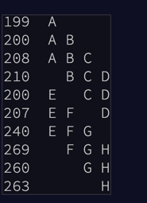

# AdventOfCode2021

https://adventofcode.com/2021/

##[Day 1](https://adventofcode.com/2021/day/1)

 _beeps under the sea (🎵 under the seaaaa under the seeea 🦀 🎵)_

As the submarine drops below the surface of the ocean, it automatically performs a sonar sweep of the nearby sea floor. On a small screen, the sonar sweep report (your puzzle input) appears: each line is a measurement of the sea floor depth as the sweep looks further and further away from the submarine.
To do this, count the number of times a depth measurement increases from the previous measurement.

**How many measurements are larger than the previous measurement?**

--- [Part Two](https://adventofcode.com/2021/day/1#part2https://adventofcode.com/2021/day/1#part2) ---

 part two

Considering every single measurement isn't as useful as you expected: there's just too much noise in the data.

Instead, consider sums of a three-measurement sliding window.

Start by comparing the first and second three-measurement windows.
The sum of measurements in the second window is larger than the sum of the first, so this first comparison increased.

Your goal now is to count the number of times the sum of measurements in this sliding window increases from the previous sum. So, compare A with B, then compare B with C, then C with D, and so on. Stop when there aren't enough measurements left to create a new three-measurement sum.
Consider sums of a three-measurement sliding window. **How many sums are larger than the previous sum**?

